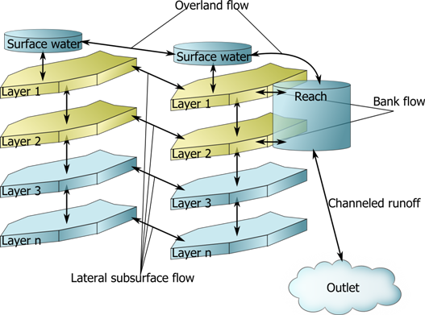

@page CmfTut3d.md

[index..](CmfTutStart.md)

# 3D Model

The extension to a three dimensional landscape model essentially amounts
to a process of allocating additional cells in the same fashion as for
the 2D case. Topological information from existing data, where elevation
grids are a very convenient starting point, is utilized to develop the
lateral connections between the soil layers and the surface water
automatically. From the standpoint of the framework, this procedure
simply amounts to the allocation of increased number of model elements,
although the complete definition of the full catchment model does
require a number of addition types of water storage to effectively
capture the variability and complexity of real world systems. These
elements include water transport and storage by streams, dams, lakes and
drainage pipe systems, the use of which is outlined in Figure 5 and code
snippet 9. This is not to suggest that this type of fully-defined and
physically-based catchment model is not without fault – a fact that has
been the focus of a significant part of the hydrologic literature since
the development of the Freeze and Harlan (1969) blueprint for the
development of such a model. Going beyond discussions of
parameterization and scale, the complexity of this approach, within CMF,
leads to a significant demand for computational power and with standard
machines, is suitable only for small catchments (less than 10 ha) at
this time. One mechanism to alleviate some of these shortcomings is to
invoke simplifications that are appropriate for different simulation
goals.

    #!python
    import cmf
    p=cmf.project()
    r_curve=cmf.VanGenuchtenMualem()
    # Load cell polygons from file
    polygons=cmf.shapefile('cells.shp')
    # create cell mesh from polygons
    cells = cmf.cells_from_polygons(polygons, …)
    # Calculate flow accumulation
    p.calc_flow_acc()
    for c in p.cells:
        # Add ten layers 
        for i in range(10):
            c.AddLayer((i+1)*0.1,r_curve)
        cmf.Richards.use_for_cell(c)
        c.surfacewater_as_storage()
    # subsurface flow
    cmf.connect_cells_with_flux(p,cmf.Richards_lateral)
    # surface runoff
    cmf.connect_cells_with_flux(p,cmf.Manning_Kinematic)

[index...](CmfTutStart.md)

author: ina, version: 4 Mon Jul 15 15:34:49 2013
