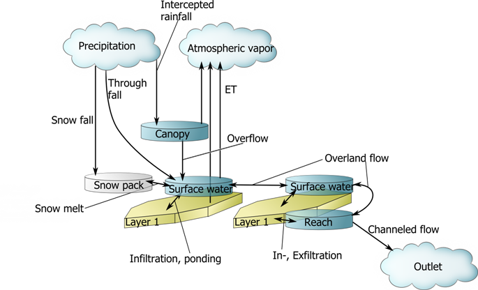

@page SurfaceFlow.md

Back to HowTo

# A collection of different surface fluxes

The 1D model described above is only valid to use when the water input
to the surface water is the canopy throughfall and no snow fall occurs.
Evaporation and transpiration from vegetation surfaces is entirely
neglected. To apply it for many common situations, surface water
storages must also be defined. To incorporate interception losses, a
canopy water storage is created and connected with the rainfall source.
A snow pack water storage receives snow fall and releases the snow melt
water to the surface water. For more advanced snow pack simulations a
storage of liquid water in the snow pack can be incorporated.

    #!python
    import cmf
    p=cmf.project()
    cell=p.NewCell(0,0,0,100)
    # Applying the connection on the cell 
    # creates the necessary storage
    cmf.CanopyOverflow.use_for_cell(cell)
    # Transform the surface water node to a storage
    cell.surfacewater_as_storage()
    # Add a snow pack, creates connections automatically
    cmf.SimpleTindexSnowMelt.use_for_cell(cell)
    # Create ET for each layer
    cmf.PenmanMonteith.use_for_cell(c)
    # Create an outlet, 10m from the cell center
    outlet=cmf.NewOutlet('Outlet',cmf.point(10,0,-0.1))
    # Create a reach of 10m length, with triangular crosssection
    reach = p.NewReach(cmf.TriangularReach(10))
    # Connect the reach to the outlet and the cell
    reach.set_outlet(outlet)
    reach.add_cell(cell,True,2,10)

Back to HowTo

author: philipp, version: 5 Fri Dec 21 14:46:06 2012
